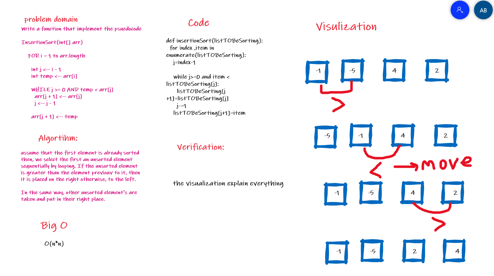

# Challenge Summary

### Write a function that use inserting sort for sort a list of number

## Whiteboard Process

## Approach & Efficiency

O(n\*n)

## Solution

[code](https://github.com/amarh-ayman/401_data-structures-and-algorithms/tree/main/Data-Structures/Sorting/sorting/Data-Structures/Sorting/sorting/insertionSort.py)

[test code](https://github.com/amarh-ayman/401_data-structures-and-algorithms/blob/main/Data-Structures/Sorting/tests/test_insertionSort.py)
