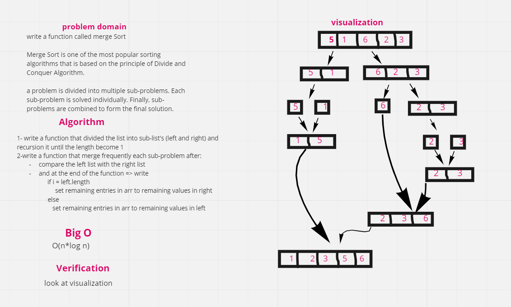

# Challenge Summary

### Write a function that use Merging Sort for sort a list of number

## Whiteboard Process

## Approach & Efficiency

O(n\*log(n))

## Solution

[code](https://github.com/amarh-ayman/401_data-structures-and-algorithms/tree/main/Data-Structures/Sorting/sorting/Data-Structures/Sorting/sorting/mergeSort.py)

[test code](https://github.com/amarh-ayman/401_data-structures-and-algorithms/blob/main/Data-Structures/Sorting/tests/test_mergeSort.py)

[Blog](https://amarh-ayman.github.io/401_data-structures-and-algorithms/Data-Structures/Sorting/Data-Structures/Sorting/readme_files/Data-Structures/Sorting/readme_files/mergeSort_Blog)
