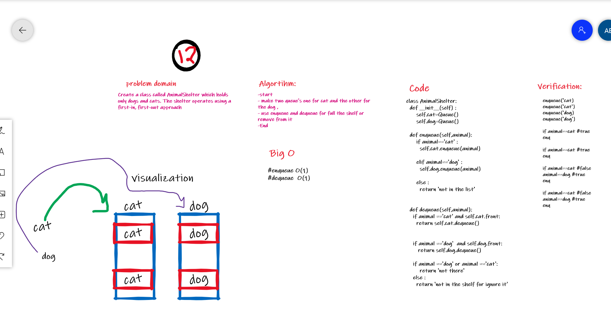

# Challenge Summary

Create a class called AnimalShelter which holds only dogs and cats. The shelter operates using a first-in, first-out approach

## Whiteboard Process

## Approach & Efficiency

### Big O

enqueue ==> O(1)  
dequeue==>O(1)

## Solution

will found all in this link [zip code](https://github.com/amarh-ayman/401_data-structures-and-algorithms/blob/main/Data-Structures/challenges/fifo_animal_shelter/fifo_animal_shelter.py)
