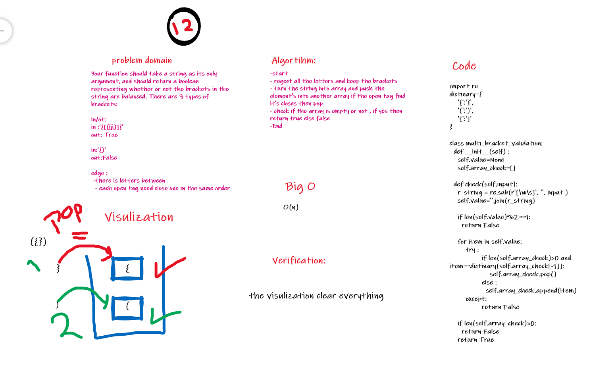

# Challenge Summary

## multi_bracket_validation

Your function should take a string as its only argument, and should return a boolean representing whether or not the brackets in the string are balanced. There are 3 types of brackets

## Whiteboard Process

## Approach & Efficiency

### Big O

time ==> O(n)  
space==>O(1)

## Solution

will found all in this link [zip code](https://github.com/amarh-ayman/401_data-structures-and-algorithms/blob/main/Data-Structures/challenges/multi_bracket_validation/multi_bracket_validation.py)
