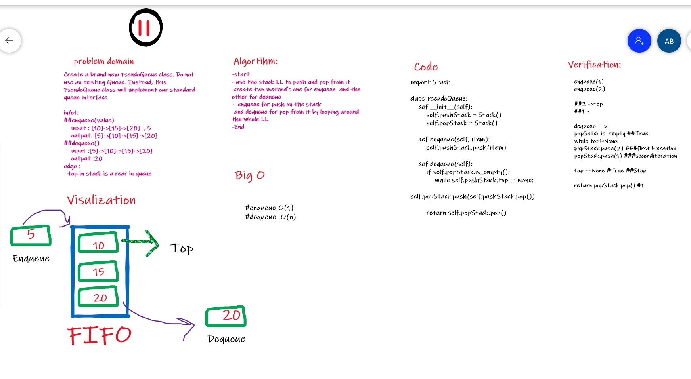

# Challenge Summary

PseudoQueue by Implement a Queue using two Stacks

## Whiteboard Process

## Approach & Efficiency

### Enqueue **O(1)**

### Dequeue **O(n)**

## Solution

[Click on the Link](https://github.com/amarh-ayman/401_data-structures-and-algorithms/blob/main/Data-Structures/challenges/queueWithStacks/queue_with_stacks.py)
