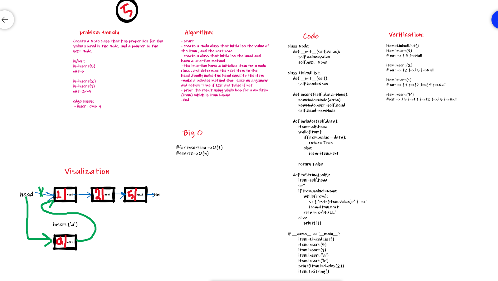
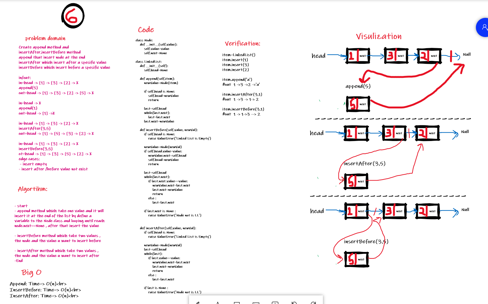
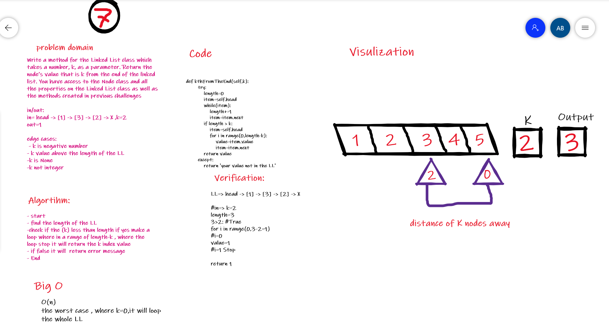

# 401_data-structures-and-algorithms

## problem Solving for the Linked List item

## **_Singly Linked List_**

- Like arrays, Linked List is a linear data structure. Unlike arrays, linked list elements are not stored at a contiguous location; the elements are linked using pointers.

### **Why Linked List?**

> Arrays can be used to store linear data of similar types, but arrays have the following limitations.

- The size of the arrays is fixed: So we must know the upper limit on the number of elements in advance. Also, generally, the allocated memory is equal to the upper limit irrespective of the usage.
- Inserting a new element in an array of elements is expensive because the room has to be created for the new elements and to create room existing elements have to be shifted. For example, in a system, if we maintain a sorted list of IDs in an array id[]. id[] = [1000, 1010, 1050, 2000, 2040]. And if we want to insert a new ID 1005, then to maintain the sorted order, we have to move all the elements after 1000 (excluding 1000). Deletion is also expensive with arrays until unless some special techniques are used. For example, to delete 1010 in id[], everything after 1010 has to be moved.

## Advantages over arrays

- Dynamic size
- Ease of insertion/deletion

## Drawbacks:

- Random access is not allowed. We have to access elements sequentially starting from the first node. So we cannot do binary search with linked lists efficiently with its default implementation. Read about it here.
- Extra memory space for a pointer is required with each element of the list.
- Not cache friendly. Since array elements are contiguous locations, there is locality of reference which is not there in case of linked lists.

### Representation:

A linked list is represented by a pointer to the first node of the linked list. The first node is called the head. If the linked list is empty, then the value of the head is NULL. Each node in a list consists of at least two parts:

- data
- Pointer (Or Reference) to the next node

# Challenge

Create Linked-List using Python.

# Approach & Efficiency

insert: Time=> O(1)  
Append: Time=> O(n) 
Includes: Time=> O(n) 
InsertBefore: Time=> O(n) 
InsertAfter: Time=> O(n) 
kthFromEnd(k) : Time=> O(n)
 

# WhiteBoard

## CC05

## CC06

## CC07

===================================

## Task List

- [x] Can successfully instantiate an empty linked list
- [x] Can properly insert into the linked list
- [x] The head property will properly point to the first node in the linked list
- [x] Can properly insert multiple nodes into the linked list
- [x] Will return true when finding a value within the linked list that exists
- [x] Will return false when searching for a value in the linked list that does not exist
- [x] Can properly return a collection of all the values that exist in the linked list
- [ ] delete items
- [ ] search by hash table
- [ ] double linked list
- [ ] cycle linked list

===================================
