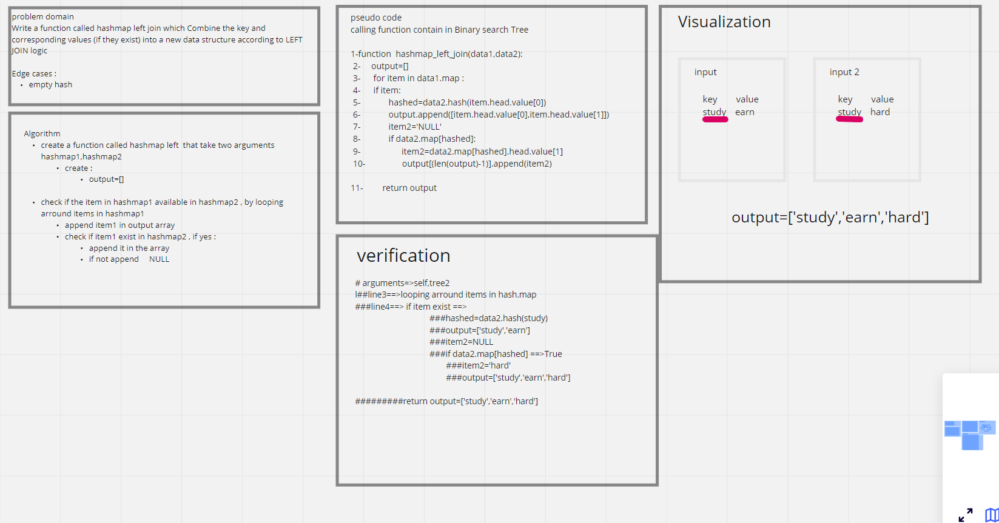

# Challenge Summary

Write a function called hashmap left join which Combine the key and corresponding values (if they exist) into a new data structure according to LEFT JOIN logic.

## Whiteboard Process

## Approach & Efficiency

time O(n)
space O(1)

## Solution

[code](https://github.com/amarh-ayman/401_data-structures-and-algorithms/tree/main/Data-Structures/trees/Code_Challenges/ALgorithm/hashmap_left_join.py)

[test](https://github.com/amarh-ayman/401_data-structures-and-algorithms/tree/main/Data-Structures/trees/tests/test_hashmap_left_join.py)
