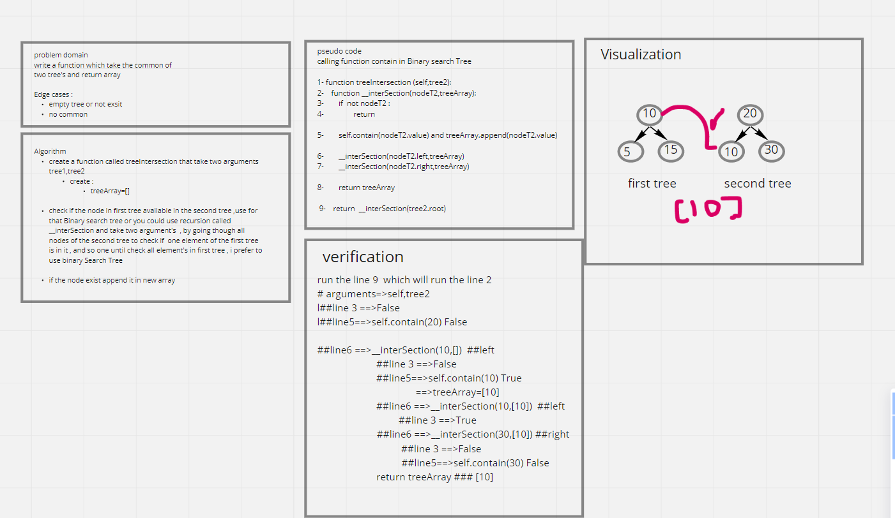

# Challenge Summary

Write a function called tree intersection which find the common values in both binary trees and return array

## Whiteboard Process

## Approach & Efficiency

time O(n\*n)
space O(1)

## Solution

[hashmap_repeated_word](https://github.com/amarh-ayman/401_data-structures-and-algorithms/tree/main/Data-Structures/challenges/Algorithm/hashmap_tree_intersection/hashmap_tree_intersection.py)
