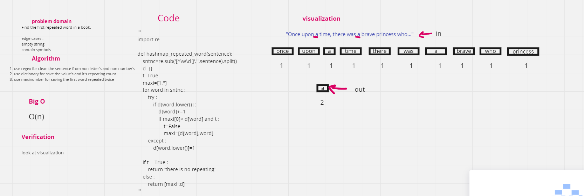

# Challenge Summary

Write a function called repeated word that finds the first word to occur more than once in a string

## Whiteboard Process

## Approach & Efficiency

time O(n)
space O(n)

## Solution

[code](https://github.com/amarh-ayman/401_data-structures-and-algorithms/tree/main/Data-Structures//trees/Code_Challenges/ALgorithm/hashmap_repeated_word.py)

[test](https://github.com/amarh-ayman/401_data-structures-and-algorithms/tree/main/Data-Structures/trees/tests/test_hashmap_repeated_word.py)
