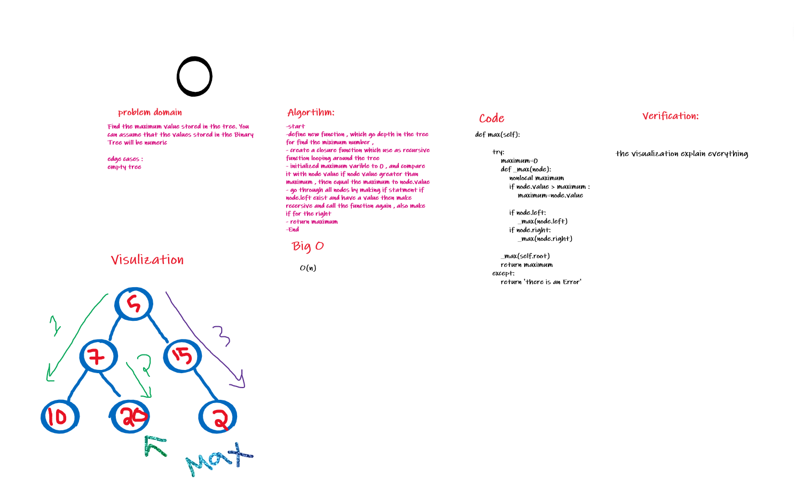

# Challenge Summary

### Find the maximum value stored in the tree. You can assume that the values stored in the Binary Tree will be numeric.

## Whiteboard Process

## Approach & Efficiency

the worst case for Big O =>O(n)
 
because it loop all the node

## Solution

[code](https://github.com/amarh-ayman/401_data-structures-and-algorithms/blob/main/Data-Structures/trees/Binary_tree/BinaryTree.py)
[test](https://github.com/amarh-ayman/401_data-structures-and-algorithms/blob/main/Data-Structures/trees/tests/test_tree.py)
