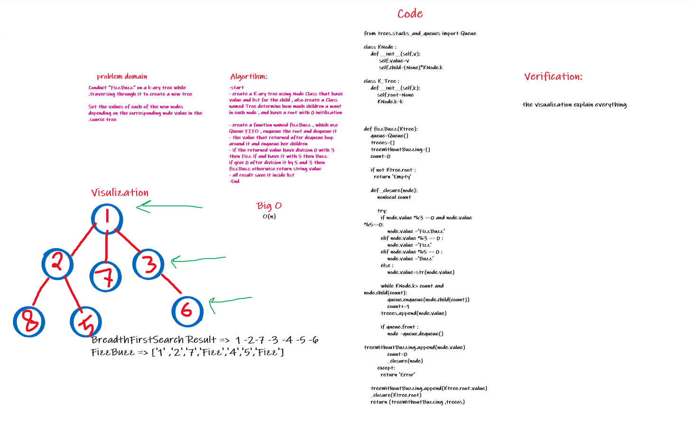

# Challenge Summary

## FizzBuzz

### Write a function called fizz buzz tree

- Arguments: k-ary tree
- Return: new k-ary tree

  ### Determine whether or not the value of each node is divisible by 3, 5 or both. Create a new tree with the same structure as the original, but the values modified as follows:

  - If the value is divisible by 3, replace the value with “Fizz”
  - If the value is divisible by 5, replace the value with “Buzz”
  - If the value is divisible by 3 and 5, replace the value with “FizzBuzz”
  - If the value is not divisible by 3 or 5, simply turn the number into a String.

## Whiteboard Process

## Approach & Efficiency

Big O(n)

## Solution

[code](https://github.com/amarh-ayman/401_data-structures-and-algorithms/blob/main/Data-Structures/trees/trees/FizzBuzz.py) 

[test](https://github.com/amarh-ayman/401_data-structures-and-algorithms/tree/main/Data-Structures/trees/tests/test_test_FizzBuzz.py)
