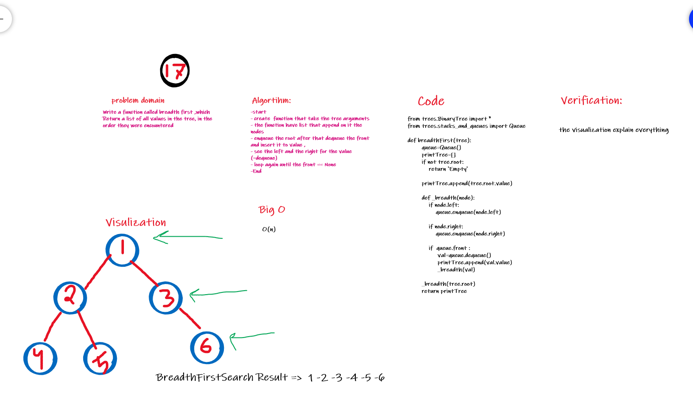

# Challenge Summary

## Breadth First Search

### Write a function called breadth first ,which Return a list of all values in the tree, in the order they were encountered

## Whiteboard Process

## Approach & Efficiency

it will go through all nodes so, it have Big O(n)

## Solution

[code](https://github.com/amarh-ayman/401_data-structures-and-algorithms/blob/main/Data-Structures/trees/trees/tree_breadth_first.py) 

[test](https://github.com/amarh-ayman/401_data-structures-and-algorithms/tree/main/Data-Structures/trees/tests/test_breadthFirst.py)
