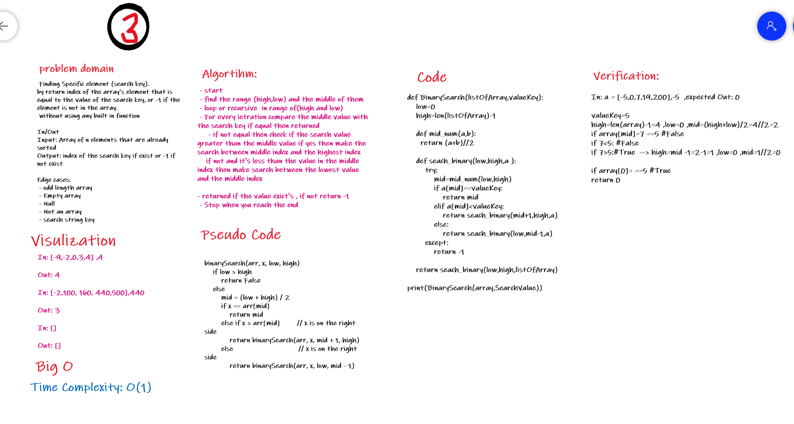

# 401_data-structures-and-algorithms

## problem Solving for the array Binary Search Challenge

Solution for find out specific number in array using Binary Search ,Without any build in method
  

## Approach and Efficiency

Big O is O(1)
the solution depend on compare the Searching_value with the value of middle index of the high and low index'x, if not found , check if the searching_value bigger or less than middle ,after that re range the high and low index ;
so it's **(1) becuase it's seaching because the searching depend just on 3 element's**
