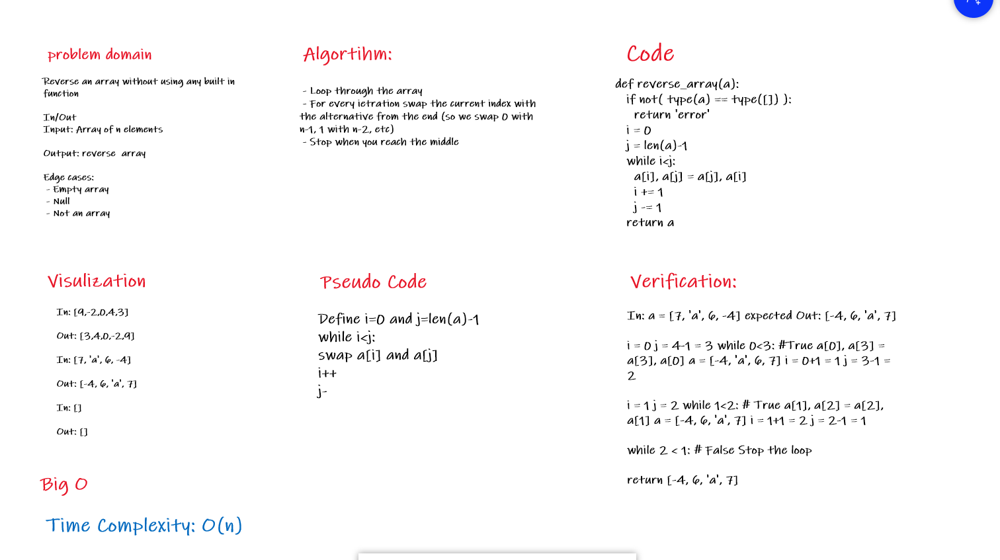

# 401_data-structures-and-algorithms

## problem Solving for the reverse array Challenge

solution for reverse array without any built in method
  

## Approach @ Efficiency

Big O is O(n) ; cause for loop will pass through all item's
